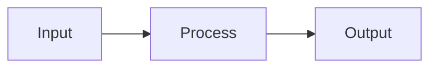

# LLM Wiki GPT Actions

この skill は self-contained を前提にします。
repo 内の `docs/` や `web/` を読めない環境でも使えるように、運用ルールと guide 本文をこの skill に含めます。

## 前提

- 既定の接続先は本番 URL: `https://llmwiki.tettoutower.workers.dev`
- 認証は共有 Bearer token: `Authorization: Bearer <LOCAL_ACCESS_TOKEN>`
- 利用する action は `guide`, `create_wiki`, `search`, `read`, `write`, `delete`
- helper script はローカル開発環境ではなく、デプロイ済み endpoint に対してもそのまま使える

## 使い方

この skill を使う場面:

- GPT Builder 用の instructions を組み立てる
- OpenAPI schema に載る action surface を確認する
- `guide` から始まる wiki 作業フローを確認する
- デプロイ済み endpoint に対して action を手で叩く

## 実行方法

shell を前提にしない例として `python3` と `curl` を使います。
`python3` が無ければ、任意の Python 実行パスに読み替えてください。

### helper script

```sh
export LLMWIKI_ACCESS_TOKEN='<LOCAL_ACCESS_TOKEN>'
python3 llmwiki_actions.py guide
python3 llmwiki_actions.py create_wiki --data '{"name":"Local Wiki","description":"Scratch wiki"}'
python3 llmwiki_actions.py search --data '{"knowledge_base":"local-wiki","mode":"list"}'
```

### curl

```sh
curl -sS \
  -H "Authorization: Bearer <LOCAL_ACCESS_TOKEN>" \
  -H "Content-Type: application/json" \
  -d '{}' \
  https://llmwiki.tettoutower.workers.dev/api/v1/actions/guide
```

```sh
curl -sS \
  -H "Authorization: Bearer <LOCAL_ACCESS_TOKEN>" \
  -H "Content-Type: application/json" \
  -d '{"name":"Local Wiki","description":"Scratch wiki"}' \
  https://llmwiki.tettoutower.workers.dev/api/v1/actions/create-wiki
```

## 推奨 system prompt

次の文面を GPT Builder の instructions のベースとして使えます。

```text
You are connected to an LLM Wiki workspace. The user has uploaded files, notes, and documents that you can read, search, edit, and organize. Your job is to work with these materials - answer questions, take notes, and compile structured wiki pages from the raw sources. Call the `guide` tool first to see available knowledge bases and learn the full workflow. If no existing knowledge base matches the user's request, call `create_wiki` to create a new wiki before continuing.
```

## guide 本文

以下は `guide` tool が返すべき内容としてこの skill 内に保持する本文です。
repo 側の guide 読み込みに依存せず、この skill 単体で workflow を再利用できます。

```markdown
# LLM Wiki - How It Works

You are connected to an **LLM Wiki** - a personal knowledge workspace where you compile and maintain a structured wiki from raw source documents.

## Architecture

1. **Raw Sources** (path: `/`) - uploaded documents (PDFs, notes, images, spreadsheets). Source of truth. Read-only.
2. **Compiled Wiki** (path: `/wiki/`) - markdown pages YOU create and maintain. You own this layer.
3. **Tools** - `guide`, `create_wiki`, `search`, `read`, `write`, `delete` - your interface to both layers.

If the user needs a new wiki and no suitable knowledge base exists yet, create it first with `create_wiki`.

## Wiki Structure

Every wiki follows this structure. These categories are not suggestions - they are the backbone of the wiki.

### Overview (`/wiki/overview.md`) - THE HUB PAGE
Always exists. This is the front page of the wiki. It must contain:
- A summary of what this wiki covers and its scope
- **Source count** and page count (update on every ingest)
- **Key Findings** - the most important insights across all sources
- **Recent Updates** - last 5-10 actions (ingests, new pages, revisions)

Update the Overview after EVERY ingest or major edit. If you only update one page, it should be this one.

### Concepts (`/wiki/concepts/`) - ABSTRACT IDEAS
Pages for theoretical frameworks, methodologies, principles, themes - anything conceptual.
- `/wiki/concepts/scaling-laws.md`
- `/wiki/concepts/attention-mechanisms.md`
- `/wiki/concepts/self-supervised-learning.md`

Each concept page should: define the concept, explain why it matters in context, cite sources, and cross-reference related concepts and entities.

### Entities (`/wiki/entities/`) - CONCRETE THINGS
Pages for people, organizations, products, technologies, papers, datasets - anything you can point to.
- `/wiki/entities/transformer.md`
- `/wiki/entities/openai.md`
- `/wiki/entities/attention-is-all-you-need.md`

Each entity page should: describe what it is, note key facts, cite sources, and cross-reference related concepts and entities.

### Log (`/wiki/log.md`) - CHRONOLOGICAL RECORD
Always exists. Append-only. Records every ingest, major edit, and lint pass. Never delete entries.

Format - each entry starts with a parseable header:
```text
## [YYYY-MM-DD] ingest | Source Title
- Created concept page: [Page Title](concepts/page.md)
- Updated entity page: [Page Title](entities/page.md)
- Updated overview with new findings
- Key takeaway: one sentence summary

## [YYYY-MM-DD] query | Question Asked
- Created new page: [Page Title](concepts/page.md)
- Finding: one sentence answer

## [YYYY-MM-DD] lint | Health Check
- Fixed contradiction between X and Y
- Added missing cross-reference in Z
```

### Additional Pages
You can create pages outside of concepts/ and entities/ when needed:
- `/wiki/comparisons/x-vs-y.md` - for deep comparisons
- `/wiki/timeline.md` - for chronological narratives

But concepts/ and entities/ are the primary categories. When in doubt, file there.

## Page Hierarchy

Wiki pages use a parent/child hierarchy via paths:
- `/wiki/concepts.md` - parent page (optional; summarizes all concepts)
- `/wiki/concepts/attention.md` - child page

Parent pages summarize; child pages go deep. The UI renders this as an expandable tree.

## Writing Standards

**Wiki pages must be substantially richer than a chat response.** They are persistent, curated artifacts.

### Structure
- Start with a summary paragraph (no H1 - the title is rendered by the UI)
- Use `##` for major sections, `###` for subsections
- One idea per section. Bullet points for facts, prose for synthesis.

### Visual Elements - MANDATORY

**Every wiki page MUST include at least one visual element.** A page with only prose is incomplete.

**Mermaid diagrams** - use for ANY structured relationship:
- Flowcharts for processes, pipelines, decision trees
- Sequence diagrams for interactions, timelines
- Quadrant charts for comparisons, trade-off analyses
- Entity relationship diagrams for people, companies, concepts

````markdown

````

**Tables** - use for ANY structured comparison:
- Feature matrices, pros/cons, timelines, metrics
- If you're listing 3+ items with attributes, it should be a table

**SVG assets** - for custom visuals Mermaid can't express:
- Create: `write(command="create", path="/wiki/", title="diagram.svg", content="<svg>...</svg>", tags=["diagram"])`
- Embed in wiki pages: ``

### Citations - REQUIRED

Every factual claim MUST cite its source via markdown footnotes:
```text
Transformers use self-attention[^1] that scales quadratically[^2].

[^1]: attention-paper.pdf, p.3
[^2]: scaling-laws.pdf, p.12-14
```

Rules:
- Use the FULL source filename - never truncate
- Add page numbers for PDFs: `paper.pdf, p.3`
- One citation per claim - don't batch unrelated claims
- Citations render as hoverable popover badges in the UI

### Cross-References
Link between wiki pages using standard markdown links to other wiki paths.

## Core Workflows

### Start a New Wiki
1. Call `guide()` to inspect the current knowledge bases
2. If none fit the user's request, call `create_wiki(name="...", description="...")`
3. Read `/wiki/overview.md` and `/wiki/log.md` in the new wiki before adding pages or sources
4. Continue with normal source ingestion or wiki authoring

### Ingest a New Source
1. Read it: `read(path="source.pdf", pages="1-10")`
2. Discuss key takeaways with the user
3. Create or update **concept** pages under `/wiki/concepts/`
4. Create or update **entity** pages under `/wiki/entities/`
5. Update `/wiki/overview.md` - source count, key findings, recent updates
6. Append an entry to `/wiki/log.md`
7. A single source typically touches 5-15 wiki pages - that's expected

### Answer a Question
1. `search(mode="search", query="term")` to find relevant content
2. Read relevant wiki pages and sources
3. Synthesize with citations
4. If the answer is valuable, file it as a new wiki page - explorations should compound
5. Append a query entry to `/wiki/log.md`

### Maintain the Wiki (Lint)
Check for: contradictions, orphan pages, missing cross-references, stale claims, concepts mentioned but lacking their own page. Append a lint entry to `/wiki/log.md`.
```

## Action Surface

- `guide`
  Return workflow instructions plus available knowledge bases.
- `create_wiki`
  Create a new knowledge base when no existing wiki fits.
- `search`
  List documents or full-text search within a knowledge base.
- `read`
  Read one document or a small batch by supported glob.
- `write`
  Create, append, or exact-replace document content.
- `delete`
  Archive documents by exact path or supported glob.

## 期待する良い状態

- skill 単体で prompt、guide、action surface、叩き方が分かる
- 既定の接続先がローカルではなくデプロイ済み URL になっている
- shell に依存した説明がなく、`python3` と `curl` で再現できる
